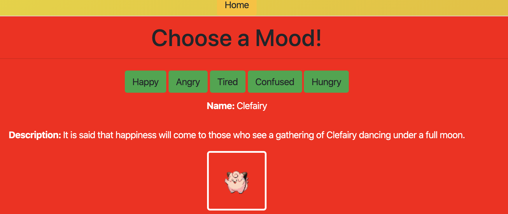

# PokeMood
PokéMood is an app created by Melanie Rogoff, Christopher (Hunter) Matthews, Brandon Perez, and Stephen Shepherd. The app enables users to see Pokémon based on their mood, as well as discover more information about particular Pokémon. 

This app leverages PokéAPI (https://pokeapi.co/) in addition to JavaScript, MySQL, Sequelizer, Node, SaaS, Express, and Heroku. 

Special Thanks To: The Pokémon Company International, Nintendo, and PokéAPI. We do not own any of the Pokémon-related content - all rights are reserved to the original creators of the Pokémon.

**Deployed Link:**

https://murmuring-mountain-45065.herokuapp.com/

**Screenshot:**

